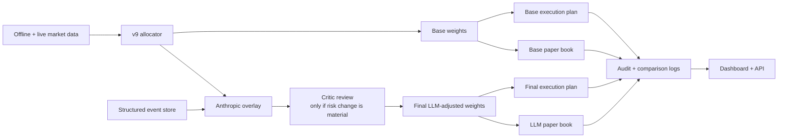
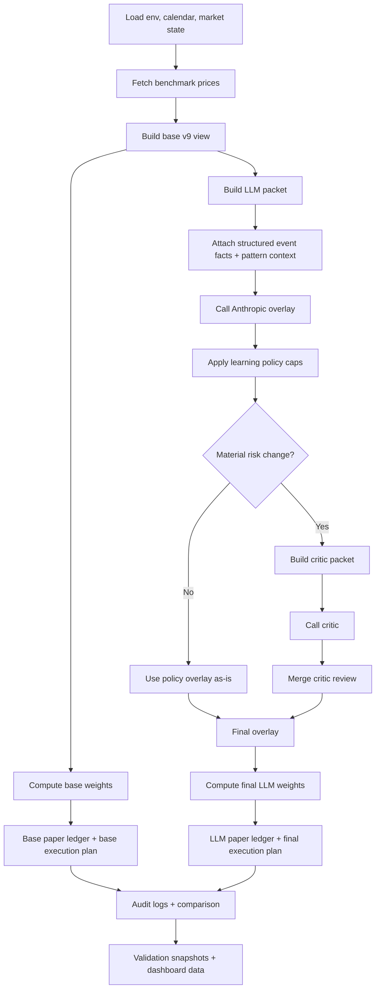
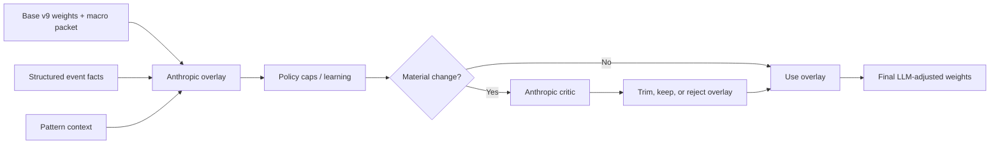
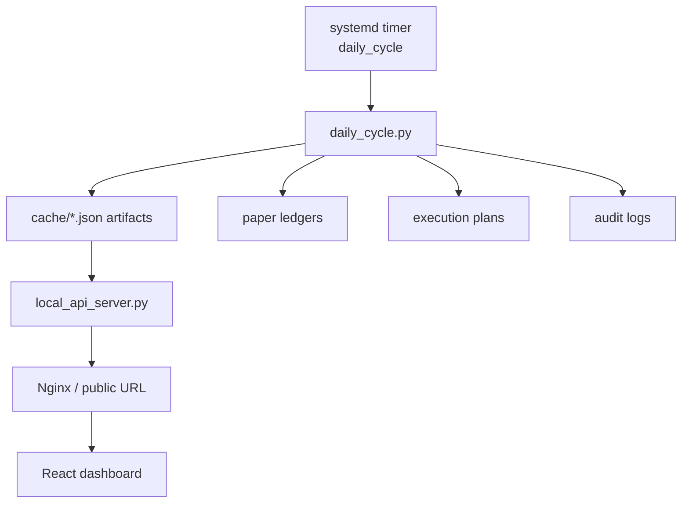

# Trader System

This repo is a production-style multi-asset trading system centered on one main allocator:

- `v9` is the portfolio engine of record
- Anthropic is used as a constrained macro risk overlay
- a second LLM critic can challenge that overlay when it materially changes risk
- both the raw model and the `model + LLM` version are stored side by side so they can be judged on realized outcomes
- paper trading, execution planning, validation, and a monitoring dashboard are all part of the same repo

The design goal is not "AI trades everything." The design goal is:

1. keep the core allocator simple enough to trust
2. let the LLM act only as a short-lived risk committee
3. log everything
4. compare base vs LLM over time
5. keep the system runnable every day with one scheduled job

## What This Repo Contains

```text
trader/
├── strategy/               # v9 engine
├── runtime/                # daily cycle, paper ledger, API server, calendar
├── execution/              # rebalance math, order plans, broker runner
├── llm/                    # Anthropic overlay, critic, learning
├── analytics/              # significance, validation, diagnostics
├── market_data/            # offline market data store and ingest tools
├── events/                 # structured event store for LLM context
├── broker/                 # Groww client and universe loading
├── research/               # Preserved challenger models and search scripts
├── strategy_library/       # Curated map of the strategies we actively keep
├── dhan_cloud/             # Single-file Dhan-friendly strategy runners
├── dashboard/              # React monitoring UI
├── deploy/                 # launchd, systemd, nginx-friendly scripts
├── config/                 # prompts, broker maps, example portfolios, local overrides
├── docs/                   # operator docs and production notes
├── tests/                  # focused tests for runtime pieces
├── data/                   # offline saved datasets
└── cache/                  # generated runtime artifacts
```

## The Big Picture



## What The Main Script Actually Does

The main daily operator command is:

```bash
python3 -m runtime.daily_cycle --portfolio-file config/portfolio_state.example.json
```

That command runs the full daily workflow end to end.

### Daily Cycle Flow



## Curated Strategy Set

The repo now has a curated strategy map in:

- [strategy_library/README.md](strategy_library/README.md)
- [strategy_library/manifest.json](strategy_library/manifest.json)

These are the seven named strategies we are intentionally keeping visible after cleanup:

- `steady_core_v9`
  - raw production `v9`
- `surge_rotation_blend`
  - `70% v9 + 30% momentum`
- `pullback_guard_blend`
  - `70% v9 + 30% pullback`
- `polaris_etf_blend`
  - the fixed shiny `v20` ETF blend
- `volume_pulse_weekly`
  - weekly slowed `mom10 x relative-volume` rotation
- `flow_pulse_weekly`
  - weekly slowed `OBV` rotation
- `atlas_jpm_blend`
  - current best JPM-inspired blend of `v9`, scorecard momentum, and diversified trend following

That curated layer is there so the production stack stays understandable even while the `research/` folder still holds the code needed to reconstruct those blends and challengers.

## How `v9` Works

The production allocator lives in:

- [strategy/v9_engine.py](strategy/v9_engine.py)

`v9` is intentionally simpler than the earlier research branches. It removes fragile daily-frequency ideas like Kelly sizing and fast HMM-like logic and keeps what survived validation better.

### Core idea

`v9` builds the portfolio in layers:

1. A diversified risk-weighted core holds the universe beta.
2. A tactical sleeve tilts toward slow cross-asset winners.
3. Daily state checks watch for breadth deterioration and crash conditions.
4. Actual trading happens on a schedule with trade bands and partial steps so turnover stays sane.
5. A narrative overlay can only reduce risk or slightly bias sleeve preference.

### Universes

The engine supports multiple price universes:

- `benchmark`
  - used for research and validation
  - long history
  - mostly index-like sleeves and domestic proxies
- `tradable`
  - used for execution planning
  - tradable ETF-like proxies
- `research`
  - experimental long-history set used by older research paths

### Why the model is fixed in production

We do not re-optimize parameters every day in production.

Instead:

- the model logic is fixed
- the rolling indicators update daily
- the LLM overlay can adapt temporarily
- the learning layer can reduce trust in the overlay over time

This is deliberate. It keeps production behavior stable and avoids turning the runtime into a daily overfitting machine.

## What The LLM Does And Does Not Do

The overlay code lives in:

- [llm/anthropic_risk_overlay.py](llm/anthropic_risk_overlay.py)
- [llm/critic_flow.py](llm/critic_flow.py)
- [config/prompts/llm_overlay_meta_prompt.md](config/prompts/llm_overlay_meta_prompt.md)

### LLM responsibilities

- read the current allocator packet
- look at structured event facts
- optionally use web search for fresh macro or geopolitical context
- suggest only a temporary defensive override
- optionally add mild asset bias
- return strict JSON only

### LLM non-responsibilities

- it does not allocate the portfolio from scratch
- it does not retrain `v9`
- it does not place orders
- it does not raise leverage
- it does not become the strategy of record

### LLM flow



### Why there are two paper books

This repo stores both:

- the base `v9` portfolio
- the `v9 + LLM` portfolio

That is the only honest way to learn whether the LLM is helping or just sounding smart. The comparison artifacts are written daily so month-end and multi-week review is straightforward.

## Paper Trading, Logging, And Comparison

The paper ledger code lives in:

- [runtime/paper_ledger.py](runtime/paper_ledger.py)
- [runtime/audit_log.py](runtime/audit_log.py)

Every daily run writes JSON artifacts into `cache/`. The important ones are:

- `daily_cycle_latest.json`
  - result of the latest daily run
- `paper_trading_latest.json`
  - current paper account for `v9 + LLM`
- `paper_base_latest.json`
  - current paper account for raw `v9`
- `paper_comparison_latest.json`
  - direct comparison of the two books
- `execution_plan_latest.json`
  - dry-run plan for the final LLM-adjusted path
- `execution_plan_base_latest.json`
  - dry-run plan for the base path
- `anthropic_overlay_latest.json`
  - raw overlay from Anthropic
- `policy_overlay_latest.json`
  - overlay after policy caps
- `active_overlay_latest.json`
  - overlay actually used after critic merge

This means the system can answer:

- what the model wanted
- what the LLM changed
- whether that changed paper performance
- how much turnover the change created

## Execution Path

Execution planning lives in:

- [execution/order_planner.py](execution/order_planner.py)
- [execution/groww_order_runner.py](execution/groww_order_runner.py)

The normal production flow is:

1. run the daily cycle
2. inspect the final execution plan
3. optionally dry-run broker payloads
4. confirm
5. place only when you are ready
6. reconcile actual holdings against target

Important:

- `daily_cycle` does not place live broker orders
- the order runner is a separate, explicit step
- this is intentional safety separation

## Offline Data Store

Market data handling lives in:

- [market_data/market_store.py](market_data/market_store.py)
- [market_data/download_offline_data.py](market_data/download_offline_data.py)
- [market_data/audit_market_data.py](market_data/audit_market_data.py)

The repo saves local datasets so backtests do not need to re-hit remote APIs every time. The flow is:

1. download and normalize bars
2. save processed matrices locally
3. audit for duplicate dates, NaNs, impossible spikes, and repaired-bar issues
4. use those local datasets for research and validation first

This makes backtests faster and more reproducible.

## Validation And Research

Analytics live in:

- [analytics/significance_report.py](analytics/significance_report.py)
- [analytics/validation_report.py](analytics/validation_report.py)

Preserved research branches live in:

- [research](research)

Those scripts now contain only the challenger models and search tooling we chose to keep after cleanup. Older discarded paths were removed so the folder is closer to the real active research surface.

The validation pack is where you look for:

- Sharpe significance
- rolling and expanding stability
- skew and kurtosis
- equity overlays
- allocation history

## Deployment Model

This repo is designed so the engine and the UI are separate concerns.



### Current production-style setup

- scheduler runs the daily job once per trading day
- dashboard serves cached JSON and a React UI
- broker order placement is still a separate human-controlled action

This is why Vercel is fine for the UI, but not ideal for the whole engine:

- the engine is stateful
- it writes JSON artifacts
- it runs on a schedule
- it benefits from local data and persistent cache

## How To Run The Repo

From the repo root:

### Main daily run

```bash
python3 -m runtime.daily_cycle --portfolio-file config/portfolio_state.example.json
```

### Exact model weights on a date

```bash
python3 -m runtime.weights_on_date --model v9 --date 2026-04-02 --json
```

### Build execution plan only

```bash
python3 -m execution.order_planner --portfolio-file config/portfolio_state.example.json
```

### Validation

```bash
python3 -m analytics.significance_report
python3 -m analytics.validation_report
```

### Dashboard

```bash
cd dashboard
npm install
npm run build

cd ..
python3 -m runtime.local_api_server --host 127.0.0.1 --port 8050
```

### Dhan Cloud runners

For Dhan-oriented one-file runners and stripped-down cloud-safe variants, start here:

- [dhan_cloud/README.md](dhan_cloud/README.md)

## What To Read Next

- [docs/RUNBOOK.md](docs/RUNBOOK.md)
  - exact operator commands
- [docs/PRODUCTION_CHECKLIST.md](docs/PRODUCTION_CHECKLIST.md)
  - what is left before unattended live trading
- [docs/INDIA_DATA_SOURCES.md](docs/INDIA_DATA_SOURCES.md)
  - data caveats, especially for India silver
- [dashboard/README.md](dashboard/README.md)
  - dashboard-specific notes

## Short Honest Status

What is true right now:

- the repo is good for paper production
- the runtime is scheduled and deployable
- the dashboard is live and operator-friendly
- the LLM overlay is constrained and auditable
- base vs LLM performance is now stored separately

What is not yet true:

- this is not "fully unattended real money" yet
- the LLM is not the strategy
- paper results still need to accumulate before trusting the overlay too much
- broker auto-placement still deserves another layer of alerting and safety checks before full autonomy
